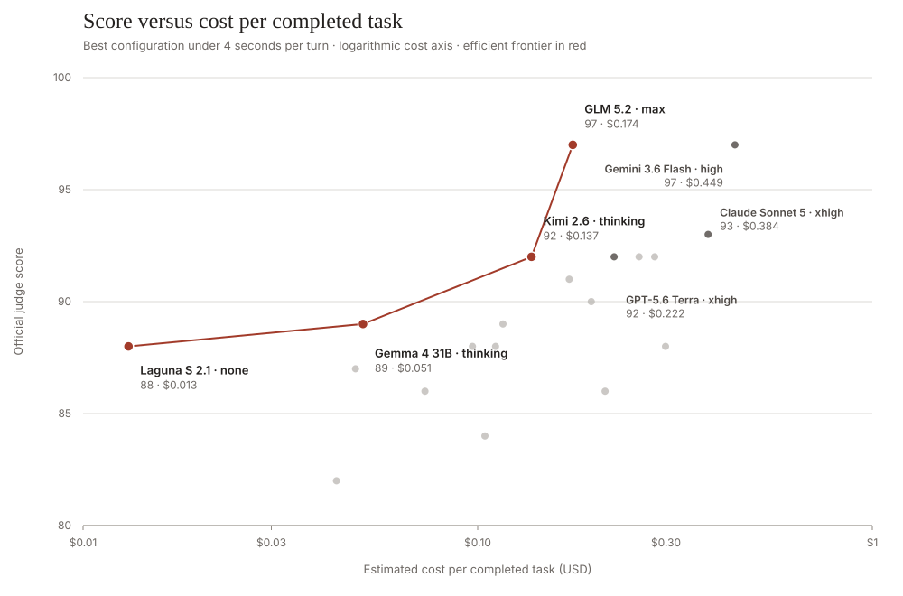
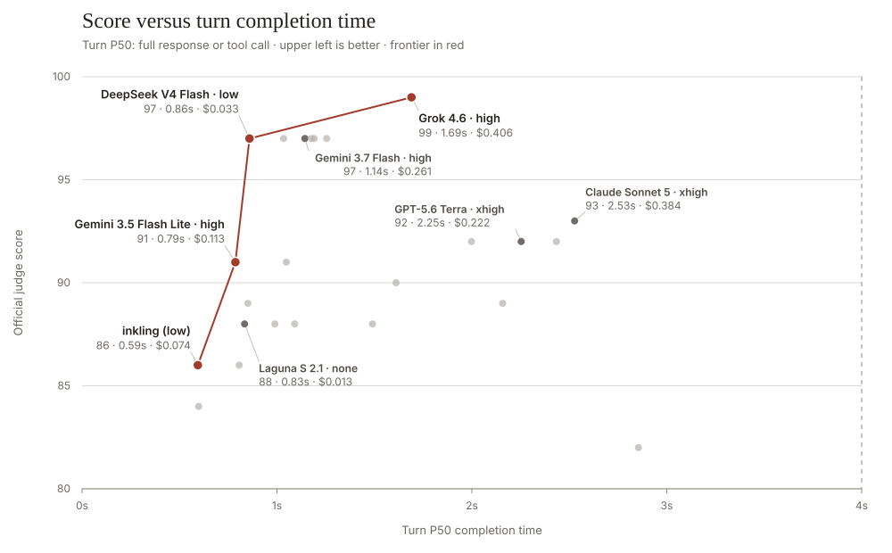

# gb-benchmarks

Benchmark repository for sub-agent tasks and orchestration things.

The goal is to build tooling to better analyze things we do in realtime AI systems that are hard for today's models.

Task definitions, world data and structured input events, and (very long) system instructions are pulled from the <a href="https://github.com/pipecat-ai/gradient-bang">gradient-bang</a> project.

## port-to-port

The first public benchmark in this repo is `../port-to-port`, which tests the following task instruction:

```
Go round-trip from our current location to the nearest mega-port. At the mega-port, recharge to full warp power.

While traveling there and back, make as much money as possible by trading optimally at profitable ports on your route without going off-course. When you're back where you started, give me a quick summary with the mega-port you used, how much warp you recharged and what it cost, how many distinct ports you traded at, and total profit or loss from the whole trip.
```

This is a reasonably well-defined task that requires interpolation of the user's intent, some multi-step planning, excellent tool calling discipline, and good state tracking. SOTA models in reasoning mode are reasonably good at performing this task (though not perfect). Claude Sonnet 4.6 is the only model that does well on this task with reasoning disabled.

Here are scores for a curated set of current models we've tested that score at least 80 and have a per-turn P50 time of less than 4 seconds. We show only the best configuration for each model on this table. The highest thinking level is not always the best-performing configuration, interestingly. All configurations and models tested, including older and lower-scoring models, are in [port-to-port/leaderboards/leaderboard-natural.md](port-to-port/leaderboards/leaderboard-natural.md).

Inkling Small narrowly misses the curated score floor: its best configuration (`high`) scored 79 with 76% task completion and a 0.41-second turn P50. See the [Inkling Small benchmark notes](port-to-port/docs/inkling-small-benchmark-notes-20260731.md) for the full effort sweep.

### Score–cost frontier



These are the configurations for which no cheaper model scores as well or better. Moving down the table buys a higher score at a higher estimated cost.

| Efficient frontier                     | Score | Task Complete | Est. Cost / Complete | Provider    |
| -------------------------------------- | ----: | ------------: | -------------------: | ----------- |
| poolside/laguna-s-2.1 (none)           |    88 |         84.0% |               $0.013 | OpenRouter  |
| gemma-4-31b (thinking)                 |    89 |        100.0% |               $0.051 | AWS Bedrock |
| kimi-2.6 Cerebras (thinking)           |    92 |        100.0% |               $0.137 | BaseTen     |
| glm-5.2 (max)                          |    97 |        100.0% |               $0.174 | BaseTen     |

### Score–time tradeoff



Configurations on the red line are not matched or beaten by a faster model. The four-second boundary is the inclusion cutoff for the main table.

### Full under-four-second leaderboard

| Model                                | Score | Task Complete | Trade /15 | Path /15 | Tools /15 | Report /15 | Turn P50 | Turn P90 | Total Time | Est. Cost / Complete | Provider    |
| ------------------------------------ | ----: | ------------: | --------: | -------: | --------: | ---------: | -------: | -------: | ---------: | -------------------: | ----------- |
| gemini-3.6-flash (high)              |    97 |        100.0% |       9.2 |     15.0 |      15.0 |       15.0 |   1176.2 |   3498.5 |      97.07 |               $0.449 | AI Studio   |
| glm-5.2 (max)                        |    97 |        100.0% |      11.0 |     14.8 |      14.3 |       14.8 |   1190.8 |  14458.6 |     212.72 |               $0.174 | BaseTen     |
| claude-sonnet-5 (xhigh)              |    93 |        100.0% |       9.6 |     15.0 |      14.1 |       15.0 |   2527.3 |  13172.9 |     246.87 |               $0.384 | Anthropic   |
| kimi-2.6 Cerebras (thinking)         |    92 |        100.0% |       7.0 |     15.0 |      15.0 |       15.0 |    497.8 |   2352.2 |      67.06 |               $0.137 | BaseTen     |
| claude-sonnet-4-6 (none)             |    92 |        100.0% |       8.2 |     15.0 |      14.5 |       13.6 |   1998.1 |   4948.2 |     125.53 |               $0.281 | Anthropic   |
| gpt-5.4 (low)                        |    92 |        100.0% |       7.6 |     15.0 |      15.0 |       14.9 |   2433.8 |  10455.4 |     136.22 |               $0.256 | OpenAI      |
| gpt-5.6-terra (xhigh)                |    92 |        100.0% |       7.4 |     15.0 |      14.7 |       15.0 |   2253.3 |   6374.1 |     136.56 |               $0.222 | OpenAI      |
| gpt-5.2 (medium)                     |    91 |        100.0% |       6.5 |     14.8 |      14.1 |       14.6 |   1047.9 |  10482.2 |     149.98 |               $0.171 | OpenAI      |
| qwen3.6-27b (high)                   |    90 |        100.0% |       6.6 |     14.5 |      14.5 |       14.9 |   1611.2 |   7699.3 |     144.80 |               $0.194 | OpenRouter  |
| gemma-4-31b (thinking)               |    89 |        100.0% |       4.0 |     15.0 |      15.0 |       15.0 |    850.6 |   1065.5 |      60.43 |               $0.051 | AWS Bedrock |
| claude-haiku-4-5-20251001 (low)      |    89 |        100.0% |       4.3 |     14.1 |      14.4 |       14.8 |   2157.9 |   6863.1 |     125.41 |               $0.116 | Anthropic   |
| nemotron-3-ultra-550b (thinking)     |    88 |        100.0% |       4.6 |     13.2 |      14.9 |       14.0 |    989.3 |   2817.5 |      81.03 |               $0.299 | BaseTen     |
| qwen3.6-35b-a3b (high, FP8)         |    88 |        100.0% |       5.3 |     13.6 |      13.4 |       15.0 |   1091.1 |   4003.3 |     101.04 |               $0.097 | OpenRouter  |
| gpt-5.6-luna (xhigh)                 |    88 |         96.0% |       6.8 |     12.9 |      14.1 |       14.0 |   1490.2 |   5967.5 |     125.40 |               $0.111 | OpenAI      |
| poolside/laguna-s-2.1 (none)         |    88 |         84.0% |       4.8 |     12.0 |      14.4 |       12.0 |    834.0 |   2592.3 |      93.44 |               $0.013 | OpenRouter  |
| gemini-3.1-flash-lite-preview (high) |    87 |        100.0% |       2.4 |     14.8 |      14.6 |       14.3 |    802.8 |   2814.8 |      67.01 |               $0.049 | AI Studio   |
| inkling (low)                        |    86 |        100.0% |       2.6 |     15.0 |      13.7 |       14.6 |    594.0 |   1337.1 |      57.16 |               $0.074 | BaseTen     |
| gpt-4.1                              |    86 |        100.0% |       2.4 |     14.3 |      14.4 |       13.7 |    805.9 |   1395.4 |      61.33 |               $0.210 | OpenAI      |
| gemini-3.5-flash-lite (minimal)      |    84 |        100.0% |       0.7 |     15.0 |      13.4 |       14.4 |    598.2 |    717.2 |      49.87 |               $0.104 | AI Studio   |
| nemotron-3-super-120b (tb=512)       |    82 |        100.0% |       1.4 |     13.0 |      13.1 |       14.1 |   2854.6 |   7666.1 |     109.38 |               $0.044 | OpenRouter  |

Cost estimates apply public API-provider list prices to measured token usage and the judged completion rate, regardless of where the benchmark ran. The Provider column names the API supplying that price, which can differ from the service used for the benchmark run. Most estimates use all 25 canonical usage traces; GPT-5.6 uses one cache-write-aware representative trace. See the [full cost table and methodology](port-to-port/leaderboards/leaderboard-natural-costs.md). Kimi and Qwen3.6 use public same-model price proxies, and Gemma uses Amazon Bedrock US Standard pricing. The Qwen3.6 scores and latency were measured on BaseTen single-H100 vLLM 0.26 deployments with prefix caching and MTP: official BF16 weights for 27B and the official FP8 checkpoint for 35B-A3B. The 27B high configuration's 7.70-second turn P90 is materially above its 1.61-second P50; the 35B-A3B high configuration is 1.09 seconds at P50 and 4.00 seconds at P90.

One note: qwen3.5-27b in thinking mode scores very well, but comes in just above the 4s turn cut-off. Advice on a faster inference stack for that model would be welcome!

## Prerequisites

- `uv` installed
- Python 3.12+
- You'll need API keys for the providers/models you run, and an ANTHROPIC_API_KEY to judge the quality of the natural language finish message.

## Example run command

```bash
ANTHROPIC_API_KEY="$ANTHROPIC_API_KEY" .venv/bin/python mini-rl-env.py \
  --provider anthropic --model claude-sonnet-4-6 \
  --task-variant natural --thinking none \
  --max-turns 50 --function-call-timeout-secs 20 \
  --log-json runs/claude-sonnet-4-6-natural-none-<ts>.json \
  > runs/claude-sonnet-4-6-natural-none-<ts>.log 2>&1
```

## Judging

- Judge runs with `evaluate_runs.py` after the raw JSON lands.
- Single run:

```bash
ANTHROPIC_API_KEY="$ANTHROPIC_API_KEY" .venv/bin/python evaluate_runs.py \
  "runs/<run-stem>.json" \
  --out-dir "runs/eval-<run-stem>" \
  --report-accuracy-judge llm \
  --judge-model claude-sonnet-4-6
```

- Batch:

```bash
ANTHROPIC_API_KEY="$ANTHROPIC_API_KEY" .venv/bin/python evaluate_runs.py \
  "runs/<glob>.json" \
  --out-dir "runs/eval-<batch-stem>" \
  --report-accuracy-judge llm \
  --judge-model claude-sonnet-4-6
```

- A non-zero run exit is still judgeable if the raw JSON exists.
- If no raw JSON exists, rerun with `--log-json` instead of trying to reconstruct the run.
