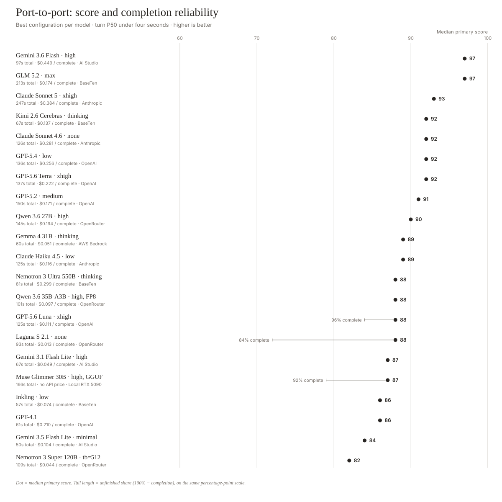

# gb-benchmarks

Benchmark repository for sub-agent tasks and orchestration things.

The goal is to build tooling to better analyze things we do in realtime AI systems that are hard for today's models.

Task definitions, world data and structured input events, and (very long) system instructions are pulled from the <a href="https://github.com/pipecat-ai/gradient-bang">gradient-bang</a> project.

## port-to-port

The first public benchmark in this repo is `../port-to-port`, which tests the following task instruction:

```
Go round-trip from our current location to the nearest mega-port. At the mega-port, recharge to full warp power.

While traveling there and back, make as much money as possible by trading optimally at profitable ports on your route without going off-course. When you're back where you started, give me a quick summary with the mega-port you used, how much warp you recharged and what it cost, how many distinct ports you traded at, and total profit or loss from the whole trip.
```

This is a reasonably well-defined task that requires interpolation of the user's intent, some multi-step planning, excellent tool calling discipline, and good state tracking. SOTA models in reasoning mode are reasonably good at performing this task (though not perfect). Claude Sonnet 4.6 is the only model that does well on this task with reasoning disabled.

Here are scores for a curated set of current models we've tested that score at least 80 and have a per-turn P50 time of less than 4 seconds. We show only the best configuration for each model on this table. The highest thinking level is not always the best-performing configuration, interestingly. All configurations and models tested, including older and lower-scoring models, are in [port-to-port/leaderboards/leaderboard-natural.md](port-to-port/leaderboards/leaderboard-natural.md).

Inkling Small narrowly misses the curated score floor: its best configuration (`high`) scored 79 with 76% task completion and a 0.41-second turn P50. See the [Inkling Small benchmark notes](port-to-port/docs/inkling-small-benchmark-notes-20260731.md) for the full effort sweep.

### Score–cost frontier


These are the configurations for which no cheaper model scores as well or better. Moving down the table buys a higher score at a higher estimated cost. DeepSeek V4 Flash 0731 at low reasoning replaces the prior 89–97-score middle of this frontier, reaching 97 at an estimated $0.0326 per completed task.

| Efficient frontier                     | Score | Task Complete | Est. Cost / Complete | Provider    |
| -------------------------------------- | ----: | ------------: | -------------------: | ----------- |
| poolside/laguna-s-2.1 (none)           |    88 |         84.0% |               $0.013 | OpenRouter  |
| deepseek-v4-flash-0731 (low)           |    97 |        100.0% |               $0.033 | Baseten     |
| grok-4.6 (high)                        |    99 |        100.0% |               $0.406 | xAI         |

### Score–turn-time frontier


These are the configurations for which no faster model scores as well or better. Turn P50 measures completion of the full response or tool call, not time to first token. Moving down the table buys a higher score at a longer median turn completion time.

| Efficient frontier                     | Score | Task Complete | Turn P50 | Provider  |
| -------------------------------------- | ----: | ------------: | -------: | --------- |
| inkling (low)                          |    86 |        100.0% |  594.0ms | Baseten   |
| gemini-3.5-flash-lite (high)           |    91 |        100.0% |  786.9ms | AI Studio |
| deepseek-v4-flash-0731 (low)           |    97 |        100.0% |  859.1ms | Baseten   |
| grok-4.6 (high)                        |    99 |        100.0% | 1690.1ms | xAI       |

### Score and completion reliability



The dot is the median primary score. A hairline tail appears only below 100% task completion; its length is the unfinished share, and the exact completion rate is labeled. The model details at left show total batch time, estimated cost per completed task, and provider.

### Full under-four-second leaderboard

| Model                                | Score | Task Complete | Trade /15 | Path /15 | Tools /15 | Report /15 | Turn P50 | Turn P90 | Total Time | Cost / Turn | Est. Cost / Complete | Provider    |
| ------------------------------------ | ----: | ------------: | --------: | -------: | --------: | ---------: | -------: | -------: | ---------: | ----------: | -------------------: | ----------- |
| grok-4.6 (high)                      |    99 |        100.0% |      15.0 |     15.0 |      15.0 |       15.0 |   1690.1 |   5550.2 |     155.75 |     $0.0117 |               $0.406 | xAI         |
| deepseek-v4-flash-0731 (low)         |    97 |        100.0% |      12.4 |     15.0 |      14.0 |       15.0 |    859.1 |   3268.6 |      98.93 |     $0.0009 |               $0.033 | Baseten     |
| gemini-3.7-flash (high)              |    97 |        100.0% |      10.7 |     15.0 |      14.4 |       15.0 |   1143.2 |   3145.7 |      97.03 |     $0.0074 |               $0.261 | AI Studio   |
| gemini-3.6-flash (high)              |    97 |        100.0% |       9.2 |     15.0 |      15.0 |       15.0 |   1176.2 |   3498.5 |      97.07 |     $0.0130 |               $0.449 | AI Studio   |
| glm-5.2 (max)                        |    97 |        100.0% |      11.0 |     14.8 |      14.3 |       14.8 |   1190.8 |  14458.6 |     212.72 |     $0.0050 |               $0.174 | Baseten     |
| deepseek-v4-pro-0813 (low)           |    97 |        100.0% |      10.7 |     14.7 |      14.8 |       15.0 |   1255.0 |  13914.4 |     178.56 |     $0.0095 |               $0.314 | Baseten     |
| kimi-2.6 (thinking)                  |    97 |         96.0% |      10.5 |     14.8 |      14.4 |       14.4 |   1034.0 |   3221.8 |      99.07 |     $0.0039 |               $0.142 | Baseten     |
| claude-sonnet-5 (xhigh)              |    93 |        100.0% |       9.6 |     15.0 |      14.1 |       15.0 |   2527.3 |  13172.9 |     246.87 |     $0.0109 |               $0.384 | Anthropic   |
| claude-sonnet-4-6 (none)             |    92 |        100.0% |       8.2 |     15.0 |      14.5 |       13.6 |   1998.1 |   4948.2 |     125.53 |     $0.0086 |               $0.281 | Anthropic   |
| gpt-5.4 (low)                        |    92 |        100.0% |       7.6 |     15.0 |      15.0 |       14.9 |   2433.8 |  10455.4 |     136.22 |     $0.0080 |               $0.256 | OpenAI      |
| gpt-5.6-terra (xhigh)                |    92 |        100.0% |       7.4 |     15.0 |      14.7 |       15.0 |   2253.3 |   6374.1 |     136.56 |     $0.0065 |               $0.222 | OpenAI      |
| gemini-3.5-flash-lite (high)         |    91 |        100.0% |       7.2 |     13.1 |      15.0 |       14.8 |    786.9 |   1710.7 |      71.85 |     $0.0032 |               $0.113 | AI Studio   |
| gpt-5.2 (medium)                     |    91 |        100.0% |       6.5 |     14.8 |      14.1 |       14.6 |   1047.9 |  10482.2 |     149.98 |     $0.0051 |               $0.171 | OpenAI      |
| qwen3.6-27b (high)                   |    90 |        100.0% |       6.6 |     14.5 |      14.5 |       14.9 |   1611.2 |   7699.3 |     144.80 |     $0.0057 |               $0.194 | OpenRouter  |
| gemma-4-31b (thinking)               |    89 |        100.0% |       4.0 |     15.0 |      15.0 |       15.0 |    850.6 |   1065.5 |      60.43 |     $0.0017 |               $0.051 | AWS Bedrock |
| claude-haiku-4-5-20251001 (low)      |    89 |        100.0% |       4.3 |     14.1 |      14.4 |       14.8 |   2157.9 |   6863.1 |     125.41 |     $0.0037 |               $0.116 | Anthropic   |
| nemotron-3-ultra-550b (thinking)     |    88 |        100.0% |       4.6 |     13.2 |      14.9 |       14.0 |    989.3 |   2817.5 |      81.03 |     $0.0092 |               $0.299 | Baseten     |
| qwen3.6-35b-a3b (high, FP8)         |    88 |        100.0% |       5.3 |     13.6 |      13.4 |       15.0 |   1091.1 |   4003.3 |     101.04 |     $0.0028 |               $0.097 | OpenRouter  |
| gpt-5.6-luna (xhigh)                 |    88 |         96.0% |       6.8 |     12.9 |      14.1 |       14.0 |   1490.2 |   5967.5 |     125.40 |     $0.0033 |               $0.111 | OpenAI      |
| poolside/laguna-s-2.1 (none)         |    88 |         84.0% |       4.8 |     12.0 |      14.4 |       12.0 |    834.0 |   2592.3 |      93.44 |     $0.0003 |               $0.013 | OpenRouter  |
| qwen3.8-27b (low, NVFP4)             |    88 |         68.0% |       6.5 |     14.7 |       8.3 |       10.2 |   3139.6 |  21740.0 |     371.18 |           — |                    — | Local RTX 5090 |
| muse-glimmer-30b (high, GGUF)        |    87 |         92.0% |       4.1 |     14.1 |      13.0 |       13.7 |    487.0 |   9429.3 |     166.07 |           — |                    — | Local RTX 5090 |
| inkling (low)                        |    86 |        100.0% |       2.6 |     15.0 |      13.7 |       14.6 |    594.0 |   1337.1 |      57.16 |     $0.0025 |               $0.074 | Baseten     |
| gpt-4.1                              |    86 |        100.0% |       2.4 |     14.3 |      14.4 |       13.7 |    805.9 |   1395.4 |      61.33 |     $0.0066 |               $0.210 | OpenAI      |
| gemini-3.5-flash-lite (minimal)      |    84 |        100.0% |       0.7 |     15.0 |      13.4 |       14.4 |    598.2 |    717.2 |      49.87 |     $0.0035 |               $0.104 | AI Studio   |
| nemotron-3-super-120b (tb=512)       |    82 |        100.0% |       1.4 |     13.0 |      13.1 |       14.1 |   2854.6 |   7666.1 |     109.38 |     $0.0014 |               $0.044 | OpenRouter  |

Grok 4.6 was tested through xAI using the exact `grok-4.6` model ID, native `reasoning.effort`, stateful Responses chaining, one stable `prompt_cache_key` per conversation, no sampling override, and no output-token cap. [xAI documents](https://docs.x.ai/developers/grok-4-6) `low`, `medium`, `high`, and `xhigh`; reasoning cannot be disabled. Independent N=25 cohorts scored 99 at high and 92 at low, both with 100% task completion; high is the published best configuration. Its $0.0117-per-turn and $0.406-per-complete estimates use [xAI's standard-context pricing](https://docs.x.ai/developers/pricing): $2/M uncached input, $0.50/M cached input, and $6/M output including reasoning tokens. Every benchmark request remained below xAI's 200K-token higher-price threshold.

Gemini 3.7 Flash was tested through Google AI Studio using the exact `gemini-3.7-flash` model ID, native `thinking_level`, no sampling override, and no output-token cap. [Google documents](https://ai.google.dev/gemini-api/docs/thinking) only `low`, `medium`, and `high` for this model—there is no `minimal` setting. Independent N=25 cohorts scored 97 at high and 92 at medium, both with 100% task completion; high is the published best configuration. Its $0.0074-per-turn and $0.261-per-complete estimates use [Google's introductory paid-tier pricing](https://ai.google.dev/gemini-api/docs/pricing) through December 31, 2026: $0.75/M uncached input, $0.075/M cached input, and $3.75/M output including thinking tokens.

Gemini 3.5 Flash-Lite was tested through Google AI Studio using the stable `gemini-3.5-flash-lite` model ID, native `thinking_level`, no sampling override, and no output-token cap. A judged five-run sweep selected high over medium; the independent N=25 high cohort scored 91 with 100% task completion. The retired `gemini-3.1-flash-lite-preview` result was removed. Cost uses Google's standard paid-tier price of $0.30/M uncached input, $0.03/M cached input, and $2.50/M output including thinking tokens.

Kimi K2.6 was tested end to end on [Baseten's Model API](https://docs.baseten.co/development/model-apis/overview) using the exact `moonshotai/Kimi-K2.6` slug. Thinking used `chat_template_args.enable_thinking=true`, `temperature=1.0`, and `top_p=0.95`; instant mode used `enable_thinking=false`, `temperature=0.6`, and `top_p=0.95`. Neither mode had an output-token cap. Independent N=25 cohorts scored 97 at thinking and 89 at instant, both with 96% task completion; thinking is the published best configuration. Its cost uses the same Baseten endpoint's measured token usage and public list prices: $0.95/M uncached input, $0.16/M cached input, and $4/M output.

DeepSeek V4 Flash 0731 and DeepSeek V4 Pro 0813 were tested through Baseten's Model API using `deepseek-ai/DeepSeek-V4-Flash-0731` and `deepseek-ai/DeepSeek-V4-Pro-0813`, respectively. Each published configuration is an independent, judged N=25 cohort with native `reasoning_effort=low`, temperature 1.0, model-default top-p, and an 8,192-token output cap. Flash scored 97 with 100% completion at an 859ms turn P50; Pro also scored 97 with 100% completion at 1255ms. The Flash high cohort is retained in the full leaderboard (95, 100% completion, 861ms) but is not the model's published best configuration. Baseten's captured Model API list prices yield measured-workload estimates of $0.0009 per Flash turn / $0.0326 per completed task and $0.0095 / $0.3136 for Pro.

Qwen 3.8 27B was served locally: the community Unsloth NVFP4 checkpoint on one RTX 5090 through a pinned SGLang build with a 32,768-token context and pool, BF16 KV cache, explicit BF16 GDN/Mamba state, radix prefix caching, no speculative decoding, and no output-token cap. Native thinking used model-card sampling (`temperature=1.0`, `top_p=0.95`, `top_k=20`) with `reasoning.effort=low`; low (88, 68% complete) outscored xhigh (87, 60% complete) and is the published best configuration. The completion shortfall is concentrated in no-tool reasoning stalls against the 32,768-token context ceiling — 8 of 25 runs at low and 10 of 25 at xhigh — which the benchmark measures rather than caps. Matching campaigns of the official checkpoints on Baseten H100s at a 262,144-token context completed 92–100%, so the stall rate is a context-budget property of this local configuration rather than the checkpoint itself.

Cost estimates apply public API-provider list prices to measured token usage and the judged completion rate, regardless of where the benchmark ran. Cost per turn is aggregate estimated cost divided by all observed LLM turns. The Provider column names the API supplying that price, which can differ from the service used for the benchmark run. Most estimates use all 25 canonical usage traces; GPT-5.6 uses one cache-write-aware representative trace. Muse Glimmer was served locally from GGUF on an RTX 5090, so no public-API cost estimate is shown. See the [full cost table and methodology](port-to-port/leaderboards/leaderboard-natural-costs.md). Qwen3.6 uses public same-model price proxies, and Gemma uses Amazon Bedrock US Standard pricing. The Qwen3.6 scores and latency were measured on Baseten single-H100 vLLM 0.26 deployments with prefix caching and MTP: official BF16 weights for 27B and the official FP8 checkpoint for 35B-A3B. The 27B high configuration's 7.70-second turn P90 is materially above its 1.61-second P50; the 35B-A3B high configuration is 1.09 seconds at P50 and 4.00 seconds at P90.

One note: qwen3.5-27b in thinking mode scores very well, but comes in just above the 4s turn cut-off. Advice on a faster inference stack for that model would be welcome!

## Prerequisites

- `uv` installed
- Python 3.12+
- You'll need API keys for the providers/models you run, and an ANTHROPIC_API_KEY to judge the quality of the natural language finish message.

## Example run command

```bash
ANTHROPIC_API_KEY="$ANTHROPIC_API_KEY" .venv/bin/python mini-rl-env.py \
  --provider anthropic --model claude-sonnet-4-6 \
  --task-variant natural --thinking none \
  --max-turns 50 --function-call-timeout-secs 20 \
  --log-json runs/claude-sonnet-4-6-natural-none-<ts>.json \
  > runs/claude-sonnet-4-6-natural-none-<ts>.log 2>&1
```

## Judging

- Judge runs with `evaluate_runs.py` after the raw JSON lands.
- Single run:

```bash
ANTHROPIC_API_KEY="$ANTHROPIC_API_KEY" .venv/bin/python evaluate_runs.py \
  "runs/<run-stem>.json" \
  --out-dir "runs/eval-<run-stem>" \
  --report-accuracy-judge llm \
  --judge-model claude-sonnet-4-6
```

- Batch:

```bash
ANTHROPIC_API_KEY="$ANTHROPIC_API_KEY" .venv/bin/python evaluate_runs.py \
  "runs/<glob>.json" \
  --out-dir "runs/eval-<batch-stem>" \
  --report-accuracy-judge llm \
  --judge-model claude-sonnet-4-6
```

- A non-zero run exit is still judgeable if the raw JSON exists.
- If no raw JSON exists, rerun with `--log-json` instead of trying to reconstruct the run.
